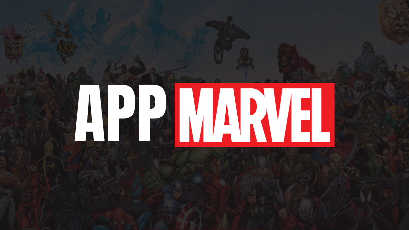
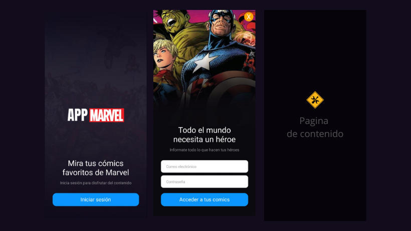
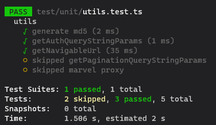

## Requisito del aplicativo

1. Pantalla de login → persistencia de datos en proveedor (mail, nombre, apellidos)
2. Autorización para la API de Marvel (según su especificación)
3. Obtener y pintar el listado de héroes, con paginación tipo endless-scroll, y con los
siguientes datos por cada uno de ellos:
- Imagen
- Nombre
- Número de cómics en los que aparece
4. Cuando se pulse un héroe del listado, navegar a su detalle con:
- Nombre
- Descripción
- Imagen
- Un listado (también endless-scroll) de los cómics en los que aparece el héroe
5. Utilizar un objeto Proxy (EcmaScript 6) mediante un proveedor (que adjuntamos en
el código base, con partes pendientes de implementar) como caché de peticiones de
API (una segunda petición con los mismos parámetros no debe generar llamadas de
red, si no obtener el valor transparentemente de dicho Proxy)
6. Dar la posibilidad de cerrar la sesión

## Video demostración

## Test unitarios
Resultado de los test actuales

## Sintaxis de los "commit"
Se añaden unos prefijos para distinguir el tipo de "commit"

- add: Añadir archivos nuevos
- feat: Una nueva característica para el usuario.
- fix: Arregla un bug que afecta al usuario.
- perf: Cambios que mejoran el rendimiento del sitio.
- build: Cambios en el sistema de build, tareas de despliegue o instalación.
- ci: Cambios en la integración continua.
- docs: Cambios en la documentación.
- refactor: Refactorización del código como cambios de nombre de variables o funciones.
- style: Cambios de formato, tabulaciones, espacios o puntos y coma, etc; no afectan al usuario.
- test: Añade tests o refactoriza uno existente.
